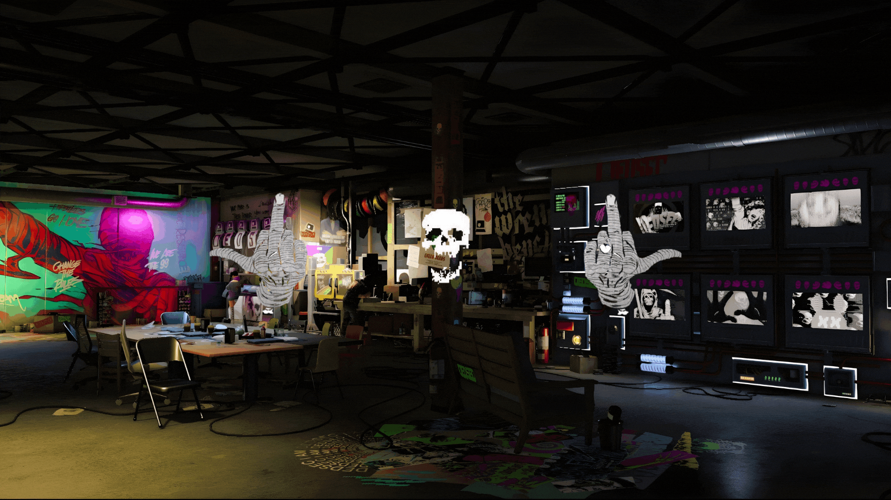
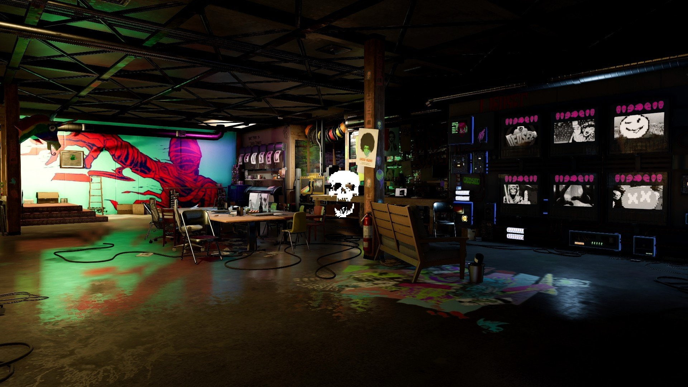
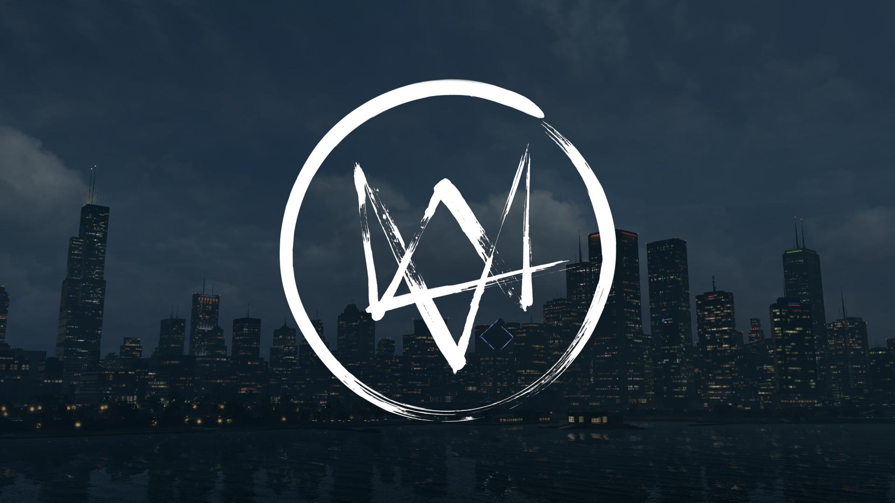

<div align="center">

# 🚀 autoHyprland

**Automated Hyprland Setup Script for Arch Linux, Kali & Parrot OS**

[](https://hyprland.org/)
[](https://archlinux.org/)
[](https://github.com/varfmx21)

*An opinionated Hyprland configuration designed for cybersecurity professionals and enthusiasts*
**🔓 We are DedSec. We are everywhere. We are watching.**

</div>

---

## 📖 What is autoHyprland?

**autoHyprland** is an automated installation script that sets up a complete Hyprland window manager environment on:
- ✅ **Arch Linux** (Fully tested)
- ✅ **Kali Linux** (Upcoming...)
- ✅ **Parrot OS** (Upcoming...)
- ⚠️ Other Debian-based distributions may work but are not officially supported

This environment is tailored to my personal preferences and workflow, but feel free to use it as a solid foundation to build your own customized setup!

---

## ⚡ Quick Installation

```bash
git clone https://github.com/varfmx21/autoHyprland.git
cd autoHyprland
chmod +x ./setup.sh
./setup.sh
```

The script will guide you through the installation process with interactive prompts.

---

## � Environment Overview

This setup includes carefully selected tools for a modern, efficient workflow:

| Component | Tool | Description |
|-----------|------|-------------|
| 🐚 **Shell** | `zsh` | Powerful shell with Powerlevel10k theme |
| 🪟 **Window Manager** | `hyprland` | Dynamic tiling Wayland compositor |
| 💻 **Terminal** | `kitty` | GPU-accelerated terminal emulator |
| 📁 **File Manager** | `thunar` | Lightweight file manager |
| 🚀 **App Launcher** | `wofi` / `rofi` | Application launcher & menu |
| 🖼️ **Wallpaper** | `swww` / `hyprpaper` | Animated or static wallpapers |
| 🔒 **Lock Screen** | `hyprlock` | Secure screen locker |
| 🌐 **Browser** | `brave` | Privacy-focused web browser |
| 🎵 **Music** | `spotify` | Music streaming client |
| 🔤 **Font** | `Hack Nerd Font` | Patched font with icons |
| 📊 **Status Bar** | `waybar` | Customizable Wayland bar |
| 🔔 **Notifications** | `swaync` | Notification daemon |

---

## 🖼️ Wallpaper Configuration

The script supports multiple wallpaper options. Choose your preferred style during installation!

### 🎞️ Animated Wallpapers (SWWW)

<div align="center">

| Wallpaper 1 | Wallpaper 2 |
|:-----------:|:-----------:|
|  |  |
| `wallpaper_1.gif` | `wallpaper_2.gif` |

</div>

### 🖼️ Static Wallpapers (Hyprpaper)

<div align="center">

| Wallpaper 1 | Wallpaper 2 | Wallpaper 3 |
|:-----------:|:-----------:|:-----------:|
|  |  |  |
| `wallpaper_1.jpg` | `wallpaper_2.png` | `wallpaper_3.jpg` |

</div>

### 📂 Wallpaper Location

**Installation Path:** `~/.config/backgrounds/`

### 🎨 Add Your Own Wallpapers

You can easily add custom wallpapers:

1. **Copy your wallpaper:**
   ```bash
   cp /path/to/your/wallpaper.jpg ~/.config/backgrounds/
   ```

2. **Modify the configuration:**
   - **For SWWW (animated):** Edit `~/.config/hypr/hyprland.conf`
     ```bash
     exec-once = swww img ~/.config/backgrounds/your_wallpaper.gif
     ```
   - **For Hyprpaper (static):** Edit `~/.config/hypr/hyprpaper.conf`
     ```bash
     preload = ~/.config/backgrounds/your_wallpaper.jpg
     wallpaper = , ~/.config/backgrounds/your_wallpaper.jpg
     ```

3. **Reload Hyprland:**
   - <kbd>SUPER</kbd> + <kbd>SHIFT</kbd> + <kbd>R</kbd> or restart your session

---

---

## ⌨️ Essential Keybindings

Master these keyboard shortcuts to navigate Hyprland like a pro!

### 📱 Basic Applications

| Keybinding | Action |
|:-----------|:-------|
| <kbd>SUPER</kbd> + <kbd>RETURN</kbd> | Open terminal (Kitty) |
| <kbd>SUPER</kbd> + <kbd>D</kbd> | Launch application menu (Wofi) |
| <kbd>SUPER</kbd> + <kbd>E</kbd> | Open file manager (Thunar) |
| <kbd>SUPER</kbd> + <kbd>SHIFT</kbd> + <kbd>F</kbd> | Open browser (Brave) |
| <kbd>SUPER</kbd> + <kbd>SHIFT</kbd> + <kbd>S</kbd> | Launch Spotify |

### 🪟 Window Management

| Keybinding | Action |
|:-----------|:-------|
| <kbd>SUPER</kbd> + <kbd>W</kbd> | Close active window |
| <kbd>SUPER</kbd> + <kbd>V</kbd> | Toggle floating mode |
| <kbd>SUPER</kbd> + <kbd>M</kbd> | Exit Hyprland |
| <kbd>SUPER</kbd> + <kbd>J</kbd> | Toggle split direction (dwindle) |
| <kbd>SUPER</kbd> + <kbd>P</kbd> | Enable pseudo-tiling mode |

### 🧭 Navigation & Focus

| Keybinding | Action |
|:-----------|:-------|
| <kbd>SUPER</kbd> + <kbd>←</kbd> | Move focus left |
| <kbd>SUPER</kbd> + <kbd>→</kbd> | Move focus right |
| <kbd>SUPER</kbd> + <kbd>↑</kbd> | Move focus up |
| <kbd>SUPER</kbd> + <kbd>↓</kbd> | Move focus down |
| <kbd>SUPER</kbd> + <kbd>Mouse Wheel Up</kbd> | Previous workspace |
| <kbd>SUPER</kbd> + <kbd>Mouse Wheel Down</kbd> | Next workspace |

### 🗂️ Workspaces (Virtual Desktops)

| Keybinding | Action |
|:-----------|:-------|
| <kbd>SUPER</kbd> + <kbd>1-9</kbd> | Switch to workspace 1-9 |
| <kbd>SUPER</kbd> + <kbd>0</kbd> | Switch to workspace 10 |
| <kbd>SUPER</kbd> + <kbd>SHIFT</kbd> + <kbd>1-9</kbd> | Move window to workspace 1-9 |
| <kbd>SUPER</kbd> + <kbd>S</kbd> | Toggle special workspace (scratchpad) |
| <kbd>SUPER</kbd> + <kbd>SHIFT</kbd> + <kbd>S</kbd> | Move window to special workspace |

### 🖱️ Mouse Controls

| Keybinding | Action |
|:-----------|:-------|
| <kbd>SUPER</kbd> + <kbd>Left Click</kbd> | Move window |
| <kbd>SUPER</kbd> + <kbd>Right Click</kbd> | Resize window |

### 📸 Screenshots

| Keybinding | Action |
|:-----------|:-------|
| <kbd>PRINT</kbd> | Capture active window |
| <kbd>SUPER</kbd> + <kbd>PRINT</kbd> | Select region to capture |

### 🔒 System Controls

| Keybinding | Action |
|:-----------|:-------|
| <kbd>SUPER</kbd> + <kbd>SHIFT</kbd> + <kbd>X</kbd> | Lock screen (Hyprlock) |
| <kbd>SUPER</kbd> + <kbd>M</kbd> | Exit Hyprland session |

### 🔊 Multimedia (Special Keys)

| Keybinding | Action |
|:-----------|:-------|
| <kbd>XF86AudioRaiseVolume</kbd> | Increase volume by 5% |
| <kbd>XF86AudioLowerVolume</kbd> | Decrease volume by 5% |
| <kbd>XF86AudioMute</kbd> | Toggle audio mute |
| <kbd>XF86AudioMicMute</kbd> | Toggle microphone mute |
| <kbd>XF86MonBrightnessUp</kbd> | Increase brightness by 5% |
| <kbd>XF86MonBrightnessDown</kbd> | Decrease brightness by 5% |

### 🎵 Media Playback (Requires playerctl)

| Keybinding | Action |
|:-----------|:-------|
| <kbd>XF86AudioPlay</kbd> | Play/Pause |
| <kbd>XF86AudioPause</kbd> | Play/Pause |
| <kbd>XF86AudioNext</kbd> | Next track |
| <kbd>XF86AudioPrev</kbd> | Previous track |

---

## 💡 Pro Tips

- 🔑 **Main Modifier**: <kbd>SUPER</kbd> refers to the Windows/Command key
- 🔄 **SHIFT Combinations**: Generally move windows instead of changing focus
- 📐 **Dwindle Layout**: The default layout automatically splits windows
- 🎯 **Special Workspace**: A hidden workspace for temporary windows (scratchpad)
- ⚡ **Quick Actions**: Most actions happen instantly with no lag

---

## 🎨 Customization

Want to personalize your setup? Edit the configuration files:

```bash
# Main Hyprland configuration
~/.config/hypr/hyprland.conf

# Keybindings section
# Look for: ### KEYBINDINGS ###
```

### 🔧 Configuration Files Structure

```
~/.config/
├── hypr/           # Hyprland configuration
├── kitty/          # Terminal settings
├── waybar/         # Status bar configuration
├── wofi/           # App launcher settings
└── backgrounds/    # Wallpaper directory
```

---

## 🖥️ System-Specific Configuration

### For Matebook D14 Users (for me varfmx21)

Enable audio support with PipeWire:

```bash
systemctl --user enable --now pipewire pipewire-pulse
```

---

<div align="center">

**Made with by [varfmx21](https://github.com/varfmx21)**

⭐ Star this repo if you find it useful!

</div>